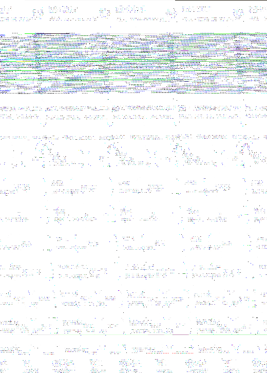

<div align="center">

# 减重助手 · Health Tools

**两个不需要账号、不需要联网、不需要安装的健康记录工具。**
**下载一个 HTML 文件，双击就能用。**

[](https://github.com/a333uu/health-tools/actions/workflows/tests.yml)

</div>

<!-- 截图占位：发布时替换为真实截图 -->
<div align="center">

</div>
<p align="center"><sub>上图是用编造的演示数据渲染的示例，不是作者的真实记录。</sub></p>

---

## 为什么做这个

我做它首先是给自己用，其次是想让更多人少走弯路。

我改变不了体重，但我能改一件事：让记录这件事不劝退你。

减重失败最常见的原因不是不知道方法，是中断。而中断基本来自两处：每天对着
App 填一堆字段太麻烦，以及单日体重涨两公斤就被报个负面。这两件我在代码里
做了硬设计，不是靠文案安慰你。

---

## 目录

| 工具 | 用途 |
|---|---|
| [`减重助手.html`](减重助手.html) | 体重趋势 + 腰围 + 打卡 + 热量定投 |
| [`服药提醒.html`](服药提醒.html) | 服药时间表与提醒 |

两个都是单文件、零依赖、数据只存在你自己浏览器里。

---

## 它解决的一个具体问题

几乎所有热量 App 都按热量缺口给分。你吃 1800，缺口 400；你吃 900，缺口 1300。
缺口涨了三倍多，App 给你的反馈就是后者更好。

我知道它们会用"健康指数"之类的机制去压，但算一下就知道压不住：分从 100 掉到
20，也只能折算两倍多，架不住缺口涨三倍。所以结果是一边跟你说别极端，一边给
极端发糖。

我自己就被带偏过。后来干脆自己写了个，核心就一句话：热量差可以攒，但攒到
"一份健康的缺口"就不再涨了。

---

## 玩法：热量定投

每天只填一个数，你今天吃了多少热量。自己算好一个总数就行，程序不替你估算
食物热量——中国食物数据缺失严重，硬做必然不可靠。

| 你的选择 | 30 天后的定投池 |
|---|---|
| 每天吃 1500 kcal | 9977 |
| 每天吃 1800 kcal | 9396 |
| 每天吃 900 kcal（极端节食） | 6715 |
| 一整天不记录 | 0 |

吃 1500 攒得最多，吃 1800 比 900 多。也就是说你饿到 900，白饿——一分都不多拿。

这个不是我加的个人喜好，是数学上保证的：入池的钱对摄入是单调的，你吃得越少
入池越少，不可能反过来。有测试盯着这条，改坏了会直接红。

---

## 为什么非得这么拧

我一开始试的是"用健康指数惩罚极端节食"，算下来不成立。极端节食的缺口是温和
节食的三倍多，健康指数那点惩罚根本压不住，除非让它掉到极低——那样正常吃饭的
人也会被误伤。

现在改成把限制放在"计入池子的缺口上限"上。好处是正常减脂完全不受影响，吃
1500 到 1800 都是满额攒。

还有个副产品：池子只增不减。没有连续打卡断了清零这种事，断一天就是那天没攒。

**你可以自己验证**（不用装任何东西，有 Node 就行）：

```bash
node tests/sim_pool_v10.mjs
```

它会逐点扫描摄入 200 到 2600 kcal，把入池曲线打出来，并检查峰值是不是落在
安全下限、两侧是不是单调。

---

## 另外几个设计选择，跟主流不太一样

**体重看 7 天中位数，不是平均数。** 某天吃咸了涨两公斤，平均数会被这条拽歪
0.6 公斤，而真实的月变化才 1 到 4 公斤。中位数只看排在中间的那个值，单日尖峰
进不了中间位。

**健康分要记哪些，你自己勾。** 一共 10 项：睡眠、饮水、步数、蛋白质、就寝规律、
每天称重、液体热量、蔬菜纤维、饮酒、放松活动。没勾的完全不参与，不扣分，也不
会绕着弯加分。

**问的是"有没有做放松的事"，不是"今天情绪好不好"。** 情绪不受你控制，为不可控
的东西打分，只会让人觉得自己不行。

**池子只增不减。** 断一天就是那天没攒，没有清零。

**文案里有禁止词表。** "失败""倒退""超标""你只"这类词是代码层面拦掉的，不靠
自觉。

---

## 想自己改 / 开分支？结构很简单

整个东西**没有构建步骤**。改完直接刷新浏览器就能看到效果。

```
减重助手.html      ← 应用本体：HTML + CSS + JS 全在一个文件里
服药提醒.html      ← 第二个应用，同样的结构
tests/             ← 测试，纯 Node.js，无第三方依赖
tools/             ← 隐私主张校验（把 README 的承诺变成机械门）
```

`减重助手.html` 内部按功能分了节，搜这些注释就能定位：

| 想改什么 | 搜这个 |
|---|---|
| 定投算法（入池公式） | `热量定投引擎` |
| 健康科目与权重 | `SUBJECTS` |
| 体重怎么算（现在是 7 日中位数） | `function w7` |
| 安全下限（女 1200 / 男 1500） | `kcalFloor` |
| 反馈文案 / 禁止词表 | `FORBIDDEN` |
| 打卡表单 | `今天记一笔` |

**改完必须跑测试**（尤其改算法）：

```bash
node tests/invariant_pool.mjs      # 破坏单调性 = 直接红
node tests/selftest_weight.mjs
```

**最容易上手的一个贡献**：加一个新的健康科目。
在 `SUBJECTS` 数组里加一项就行，例如：

```javascript
{ id: "fiber", field: "fiber", label: "膳食纤维", hint: "蔬菜粗粮豆类", w: 25,
  options: [{ v: true, label: "够", score: 100 }, { v: false, label: "不够", score: 50 }] }
```

界面的勾选框、今日页输入行、定投页的指数分解会**自动出现**，不用改渲染代码。

---

## 隐私：不是承诺，是它做不到

| 主张 | 你可以自己搜 |
|---|---|
| 零网络 | `fetch` / `XMLHttpRequest` / `WebSocket` / `sendBeacon` **各 0 处** |
| 零外部资源 | HTML 里 **0 个** `http(s)` 链接、**0 个** `<script src>` |
| 零依赖 | 运行只需**一个文件**，没有构建步骤、没有 npm |
| 数据不出本机 | 只写一个 `localStorage` 键（`weight_coach_v1` / `med_reminder_v1`），无账号、无服务器 |
| 零追踪 | `analytics` / `gtag` / `mixpanel` / `sentry` / `telemetry` **全部零命中** |

懒得自己搜就跑这个——它把上面每一条都做成了机械校验：

```bash
node tools/verify_privacy_claims.mjs
```

CI 里也在跑（见 `.github/workflows/tests.yml`），如果哪天有人加了一行联网代码，
构建会直接红。

我个人不太信"我们重视你的隐私"这种话，所以干脆把这条做成了测试。你不信也可以
自己跑一遍上面那条命令。

---

## 它不是什么（请先读这段再决定要不要用）

- **不是医疗建议来源。** 任何数字都不构成处方。安全下限（女 1200 / 男 1500 kcal）按通用膳食指南设定，**具体该吃多少请咨询医生或营养师**。
- **不帮你估算食物热量。** 只收一个总数，要你自己算。
- **不是"懒人神器"。** 它降低的是**记录摩擦**，不是要求。
- **没有云同步。** 手机浏览器清缓存可能丢数据，请定期导出备份。
- **已验证范围有限**：目前只在**一台安卓手机 + Windows 桌面浏览器**上实际使用过。其他平台欢迎反馈。

---

## 怎么用

1. 下载 `减重助手.html`（或 `服药提醒.html`）
2. 用浏览器打开 —— 就这样，没有安装步骤

手机上也可以：把文件放到手机存储里，用浏览器打开；或加到主屏幕当 App 用。

---

## 测试

全部测试**无第三方依赖**，只要能跑 Node.js：

```bash
node tests/selftest_weight.mjs    #  97 项：趋势判读 / 反馈文案 / 中位数 / 定投池
node tests/selftest.mjs           #  64 项：服药提醒（时间表 / 提醒 / 边界）
node tests/smoke_pool.mjs         #  32 项：渲染路径 / 极端节食提示 / 空数据 / 移动端布局
node tests/invariant_pool.mjs     #   8 项：核心不变量（单调性 / 峰值位置 / 与摄入无关）
node tests/sim_pool_v10.mjs       #  12 项：机制判据（跨 TDEE 与性别下限）
```

合计 **213 项断言**。其中 `invariant_pool.mjs` 是**契约测试**——
任何改动只要破坏了"吃更少不可能攒更多"，它会直接失败。

---

## 贡献

最欢迎三类：

1. **翻译** —— 尤其是受"节食文化"伤害较重的语区
2. **安全下限的本地化** —— 各地膳食指南数值不同，欢迎**带出处**提 PR
3. **新的健康科目** —— 只需在 `SUBJECTS` 注册表加一项（带权重与选项）

**不接受的 PR**：任何会削弱"吃更少不可能攒更多"这条约束的改动。
提这类 PR 请附 `tests/invariant_pool.mjs` 的通过输出。

---

## 关于维护

这是个**个人项目**，我做它首先是给自己用。

- 我会看 issue，但**不承诺响应时间**
- 功能建议可以提，但**不保证实现**
- 安全问题请优先提 issue，我会尽快看

如果一个 PR 放了一个月没人理，不是我不在乎，是我在忙别的 —— 欢迎再来推我一下。

这个项目没有依赖、没有后端、没有构建步骤，所以**不存在"需要定期维护才不会烂"的东西**。
它更像一本小册子：放在那儿，过几年打开还是能看。

---

## License

[MIT](LICENSE)

## 使用者须知（不是许可条款，是安全说明）

本软件是**记录与解读工具，不是医疗建议来源**。任何数值都不构成处方。

- 内置的"安全下限"（女性 1200 / 男性 1500 kcal）依据**通用膳食指南**设定，
  **具体应该吃多少请咨询医生或注册营养师**。
- 本软件不能替代医疗诊断、治疗或专业指导。
  如果你有进食障碍史、慢性病或正在服药，请先咨询医生再使用。
- 作者按 MIT 条款提供本软件，**不对任何健康后果承担责任**。

---

<div align="center">

**如果你正在用这个工具，希望你记得：**
**让它帮你不中断，比让它帮你更快，重要得多。**

</div>
